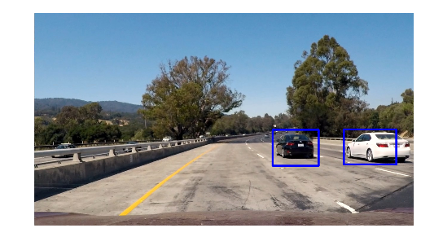

**Vehicle Detection Project**

The goals / steps of this project are the following:

* Perform a Histogram of Oriented Gradients (HOG) feature extraction on a labeled training set of images and train a classifier Linear SVM classifier
* Apply a color transform and append binned color features, as well as histograms of color, to the HOG feature vector.
* Implement a sliding-window technique and use trained classifier to search for vehicles in images.
* Run pipeline on a video stream (start with the test_video.mp4 and later implement on full project_video.mp4) and create a heat map of recurring detections frame by frame to reject outliers and follow detected vehicles.
* Estimate a bounding box for vehicles detected.

---

[//]: # (Image References)
[image1]: pics_readme/sample_image.png
[image2]: pics_readme/hog_car.png
[image3]: pics_readme/hog_notcar.png
[image4]: pics_readme/sliding_window.png
[image5]: pics_readme/pipeline_image.png
[image6]: pics_readme/heatmap_image.png
[image7]: pics_readme/detected_image.png
[image8]: pics_readme/outcome_image.png
[video1]: ./project_output5.mp4

###Histogram of Oriented Gradients (HOG)

####1. HOG features extraction from the training images.

In order to detect our objects of interest, we need to know what differentiates them from the rest of the image.
We can differenciate by choosing the color and gradients.
Only color feature will result in finding false positive image so we also have to choose the shape features. When it comes to extracting shape features, Histogram of Oriented Gradients are good choice.

The code for this step is contained in the second code cell of the Pipeline.ipynb(`get_hog_features` function)

I started by reading in all the `vehicle` and `non-vehicle` images.  Here is an example of one of each of the `vehicle` and `non-vehicle` classes:

![alt text][image1]

I then explored different color spaces and different `skimage.hog()` parameters (`orientations`, `pixels_per_cell`, and `cells_per_block`).  I grabbed random images from each of the two classes and displayed them to get a feel for what the `skimage.hog()` output looks like.

Here is an example using the `HSV` color space and HOG parameters of `orientations=8`, `pixels_per_cell=(8, 8)` and `cells_per_block=(2, 2)`:

![alt text][image2]

![alt text][image3]

####2. Final choice of HOG parameters.

I tried various combinations of parameters and my final choice of parameters are following.

|Parameters         |Number     |
|:-----------------:|:----------|
|Color Space        |HSV        |
|HOG orientations   |8          |
|HOG pixels per cell|8          |
|HOG cells per block|2          |
|HOG channels       |3 channels |

####3. Training a classifier

I trained a linear SVM using HOG features, spatial binning and color histogram features. Af first, I normalized the features so that one feature doesn't have the significant role compared with other features.
The feature vector lrngth is 5520 and test Accuracy of this support vector classifier is around 99%.

###Sliding Window Search

####1. Sliding Window implementation

Once we have made the classifier, we can search cars in an image by slicing the picture. Here's sliding window comes in. Sliding window is a method that captures images from top left to bottom right by sliding each image with overlapping. The picture below is an example of the sliding window which I used in this project.
I chose several sizes and overlap rates of sliding window so that I can extract cars from an image with multiple windows.

The code for this function is in the second code cell in the Pipeline.ipynb(`slide_window` function)

![alt text][image4]

####2. Examples of pipeline

I searched with 5 different size and overlapping windows using HSV 3-channel HOG features plus spatially binned color and histograms of color in the feature vector, which provided a nice result. Here are some example images:

![alt text][image5]
---

### Video Implementation

####1. Here is the video outputof my pipeline. The link is [link to my video result](https://www.youtube.com/watch?v=NxMLEz48gVQ&feature=youtu.be).

####2. Methods for filtering false positives and combining overlapping bounding boxes

I recorded the positions of positive detections in each frame of the video.  From the positive detections I created a heatmap and then thresholded that map to identify vehicle positions.  I then used `scipy.ndimage.measurements.label()` to identify individual blobs in the heatmap.  I then assumed each blob corresponded to a vehicle.  I constructed bounding boxes to cover the area of each blob detected.

Here's an example result showing the heatmap image, the result of `scipy.ndimage.measurements.label()` and the bounding boxes then overlaid on the image:

These functions are in the 7th code cell in the Pipeline.ipynb(heatmap:`add_heat`, threshold:`apply_threshold`,vehicle position:`drawlabels_bboxes` function)

### Here is the image of bounding boxes and their corresponding heatmaps:

![alt text][image6]

### Here is the output of `scipy.ndimage.measurements.label()` on the integrated heatmap from an image(Left:heatmap Right:integrated heatmap):
![alt text][image7]

### Here the resulting bounding boxes are drawn onto the image:
![alt text][image8]

---

###Discussion

Here I'll talk about the approach I took, what techniques I used, what worked and why, where the pipeline might fail and how I might improve it if I were going to pursue this project further.

Firstly, I made a classifier with using HOG, spatial binning and color histogram. I used linear support vector machine since it is fast and good classifier.

Then I implemented sliding windows to search cars in an image. Overlapping windows and multiple window size will result in good result, but it will take more time to classify. So we have to think about that trade-off.
In this project, I intntionally search on the right side of the image since the image is taken by a car which is on the left lane and there's no car to come from the left lane. If the car is on the center lane, we have to search on both sides(left and right). In this case, the model I proposed in this project will take far more time to detect cars. To solve this problem, I have to change the feature extraction part or sliding window part to lower the features or lower windows to search. Using convolutional neural network(CNN) will be another choice for feature extraction.

